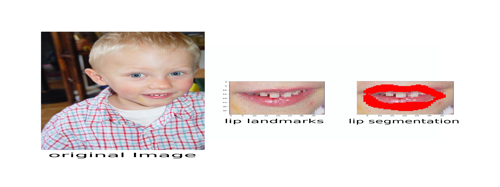
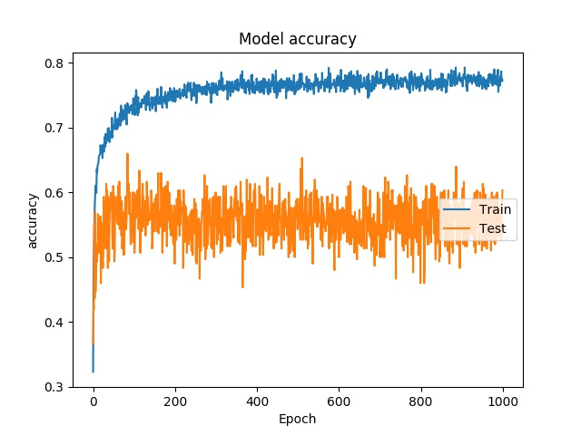
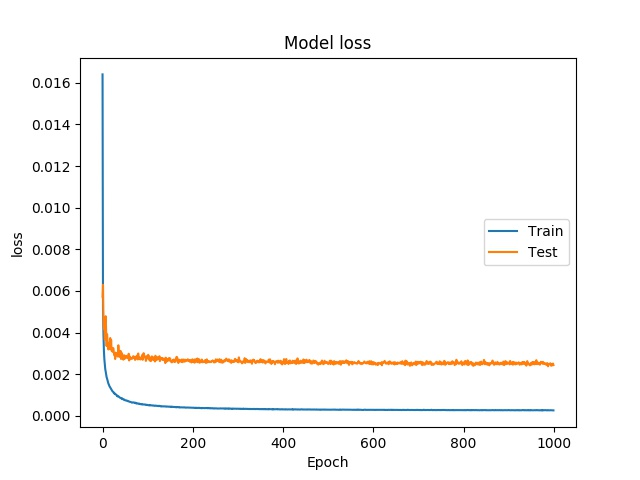
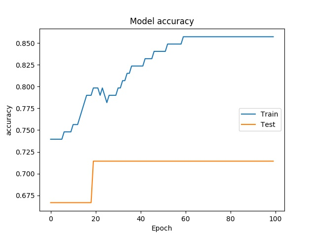
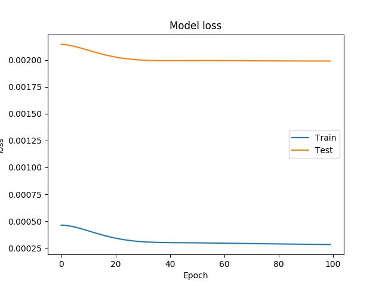

## Deep Casacade Model for Lip Segmentation
Lip segmentation plays a crucial role in numerous multimedia systems, including videoconferencing, lip reading, automatic makeup, facial expression analysis, and human-computer interfaces, among other related fields. Our project focuses on utilizing a customized tweaked deep neural network to achieve real-time and precise lip segmentation.

The network we have developed enables us to adapt and optimize the model for various lip states, such as smiling, laughing, and closed lips, among others.

Within this repository, you will find the code for performing lip segmentation on any given image. To provide you with a visual example, please refer to the following illustration:
<p align="center">
   
</p>

## Method

We employed the vanilla Tcnn architecture, as described in the [paper](https://arxiv.org/abs/1511.04031). The architectural design is illustrated in the image below:

<p align="center">
   
</p>

As depicted in the figure, our approach involves training two models.
The first model is a standard CNN, serving as the base model, which focuses on detecting lip landmarks.

The second step involves clustering the features in layer five (indicated by the red circle). To accomplish this, we train a Gaussian Mixture Model (GMM) on the intermediate features using the Expectation-Maximization (EM) algorithm. This enables us to analyze the output and determine the optimal number of clusters (K). Each cluster represents a distinct state of the lips.

To train the customized model, we utilize the weights from the base model and fine-tune them separately for each cluster. For this purpose, we freeze the convolutional part of the network and solely train the fully connected layers with a significantly reduced learning rate. Furthermore, we exclusively use the data associated with each cluster for training. As a result, each cluster possesses its own unique set of fully connected weights, leading to K distinct fully connected parts.

## Data
To ensure optimal performance, we exclusively input the lip area to our network. We achieved this by cropping the images based on the ground truth data. For this project, we utilized the Helen dataset, which comprises 2000 training images and 330 test images. This dataset offers highly accurate, detailed, and consistent annotations of the primary facial components. Specifically, we focused on the 56 lip landmarks provided within the dataset to train and evaluate our network.

In the training pipeline, the images are initially cropped based on their respective ground truth lip landmarks and subsequently fed into the network. The base model is trained as a conventional CNN. However, to fine-tune the network for each cluster, we freeze the first part of the model and solely fine-tune the last two layers. This allows us to adapt the network's performance to each specific lip state.

If you wish to make use of the AFW dataset as training data, we have provided the necessary code in `core/data.py`. To utilize this dataset, you would need to modify the function name within the `train.py` script accordingly.
## How to Run

The project has two main scripts, one for training and one for testing purposes. 

### Setup The Environment

To install all the dependencies just run the command below in your environment.

    pip install -r ./requirements.txt


### Train

To facilitate the training process on either the Helen or AFW dataset, we have already provided the necessary code. However, if you have another dataset that you would like to utilize, you can add an additional function to read and crop the lip area. Additionally, you would need to modify the function in the `train.py` script accordingly.

To execute the training script, please follow these steps:

1. Download the training data to a local directory.
2. Open the command prompt or terminal.
3. Run the following command:

```python
python train.py --data_path Path/to/the/images/folder \
--annotations_path Path/to/the/annotation/folder \
--test_csv_path Path/to/the/test/indices
```

This command will initiate the training process with the default parameters. However, if desired, you can modify these parameters to suit your specific needs.
### Evaluate

In addition to the provided code, we have also prepared evaluation diagrams that display the loss and accuracy metrics for both the backbone model and one specific head throughout each epoch. These diagrams allow you to track the performance and progress of the model during training. By examining the loss and accuracy values at each epoch, you can gain insights into how well the model is learning and improving over time. This information can be valuable for analyzing the effectiveness of the backbone model and the specific head in achieving accurate predictions.
Backbone diagrams:

<p align="center">
   
   
</p>

Head1 diagrams:
<p align="center">
   
   
</p>

### Test

To visualize the segmentation of the lips, here are the steps you can follow 
1. Train the model or download the weights from [here](https://drive.google.com/file/d/1y1-M7KvVqxcicimx7g-uQckrgxXdVvaD/view?usp=sharing)
2. Download the `shape_predictor_68_face_landmarks.dat` file, which is necessary for cropping the lip area using dlib and OpenCV.
3. Choose a test image of your choice.
4. Run the following code:

```python
python test.py --image_path Path/to/the/test_image \
--mean_image_path Path/to/the/training_images_mean \
--std_image_path Path/to/the/training_images_std \
--weights_path Path/to/the/model_weights
--shape_predictor_path Path/to/the/shape_predictor_68_face_landmarks.dat
```

Make sure to replace the placeholders `Path/to/the/test_image`, `Path/to/the/training_images_mean`, `Path/to/the/training_images_std`, `Path/to/the/shape_predictor_68_face_landmarks.dat` , and `Path/to/the/model's_weights` with the actual file paths.

By executing this code, you will be able to visualize the segmentation of the lips in the selected test image. The script will utilize dlib and OpenCV to crop the lip area, enabling the segmentation process.

** If you find this repository helpful, we would greatly appreciate it if you could consider giving it a star.
