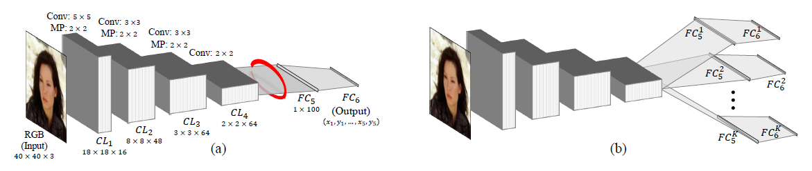

## Deep Casacade Model for Lip Segmentation

Lip segmentation is an essential stage in many multimedia systems such as videoconferencing, lip reading, automatic makeup,facial expression analysis, human computer interfaces and so much related fields. In this project we used tweaked deep network for realtime and accurate lip segmentation. This network allows us to fine tune the model for different states of the lips, like smiling, lauphing, closed and so on.

## Method

We used vannila Tcnn which has shown in the image below. As you can see in the figure we have two model to train. First we train a normal CNN (base model) which is a simple model for detecting landmarks. Secound step is to cluster the features in layer five (which indicated with the red circle) for this porpuse we train a GMM model on the intermidiate features using EM algorithm, this alows us to analysis output and find best number of clusters (K). For training the tweaked model we use the weights of base model and trying to fine tune them. Convolution part freeze and fully connected part are fine tune, But not with all of data. So each cluster will have its own fully connectected weights, and we have K fully connected part.

Vannila Tcnn architecture:

   

## Data
We fed only the lips area to the network which we obtained by cropping the images base on the ground truth data. In this work we used the Helen data set, which consists of 2000 training and 330 test images with highly accurate, detailed, and consistent annotations of the primary facial components. There is 56 landmark for lip, which we used them to 
train and evaluate our network. So first images are cropted by their ground truth landmarks and then fed to network. The base model train like normal CNN and then by freezing the first part last two layer will fine tune for each cluster.

* We have provided the code for using the AFW dataset in the `core/data.py.` In order to use this dataset as training data you need to change the function name in `train.py` script.

## How to Run

The project has two main scripts, one for training and one for testing. 

### Setup The Environment

To install all the dependencies just run the command below in your environment.

    pip install -r ./requirements.txt

### Train

We have provided the code to train the model on Helen or AFW data set. If you have another dataset please add another function to read and crop the lip area and change the function in `train.py` script. To run the train script download the training data and run the code below:

python  train.py --data_path Path/to/the/images/folder \
             --annotations_path Path/to/the/annotation/folder \
             --test_csv_path Path/to/the/test/indices

This will train the model with default parameters. You can change them as well.

### Test

After training you can choose any image for the test. Run the code below to see the segmentation of the lips:

python  test.py --image_path Path/to/the/test_image
            --mean_image_path Path/to/the/training_images_mean
            --std_image_path Path/to/the/training_images_std
            --weights_path Path/to/the/model's_weights

